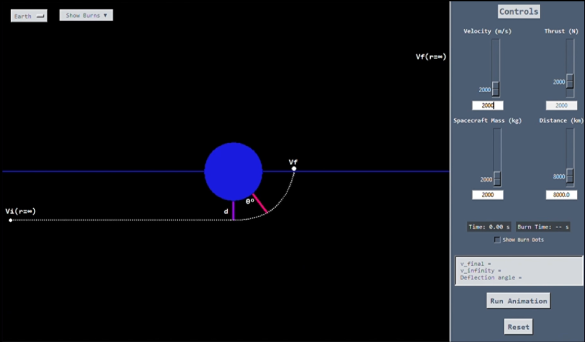
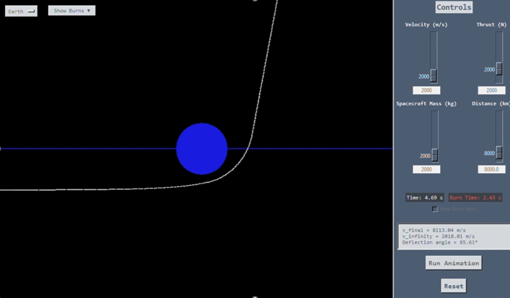

<div align="center">

# 🪐 Gravity Assist Flyby Simulator

**A real-time simulator of spacecraft gravity-assist maneuvers, built from the ground up in Python**

*Personal project, later adopted as lab exercise · Wentworth Institute of Technology*




</div>

<br>

## Table of Contents

- [Overview](#overview)
- [How It Works](#how-it-works)
- [In Action](#in-action)
- [Features](#features)
- [The Physics](#the-physics)
- [Repo Structure](#repo-structure)
- [Running It](#running-it)
- [Roadmap](#roadmap)

<br>

## Overview

A **gravity assist** (or flyby) is how missions like Voyager, Cassini, and New Horizons picked up speed without burning extra fuel: swing close enough to a planet, let its gravity bend your path, and walk away faster (or slower, or redirected) than you arrived. This project is an interactive, real-time simulator of that maneuver, letting you set a spacecraft's incoming velocity, mass, and approach distance around a planet, then watch the flyby play out and see exactly how much the planet's gravity changed its trajectory.

It started as a personal side project and grew into something detailed enough that it was adopted as a lab exercise, which pushed it from "a fun simulation" into something the underlying physics had to hold up under.

<br>

## How It Works

The simulator treats the encounter as a two-body hyperbolic approach. Given an incoming velocity and a planet's mass, the app:

1. Computes the spacecraft's speed at closest approach using energy conservation
2. Backs out the planet's local escape velocity at that distance
3. Subtracts the two (in the energy sense) to recover the hyperbolic excess velocity, **v∞**, which is what the spacecraft's speed would be if the planet's gravity weren't there
4. Uses v∞ and the approach distance to compute the **deflection angle**, how much the planet bent the flight path

Everything updates live as you move the sliders, and you can drop simulated thrust burns anywhere along the trajectory to see how they stack with the gravity assist itself.

<br>

## In Action

<div align="center">


<sub>Mid-flyby, with a thrust burn applied partway through: the live readout on the right updates in real time as the trajectory bends around the planet</sub>
</div>

<br>

## Features

- **Real-time simulation** for both Earth and Jupiter flybys, using each planet's actual mass and radius, with independently scaled slider ranges so Jupiter's much deeper gravity well behaves believably next to Earth's
- **Four live-adjustable parameters**: initial velocity, thrust, spacecraft mass, and approach distance, each with its own slider
- **Click-to-burn trajectory editing**: click anywhere along the flight path to place a thrust burn at that point, with pending, zero-thrust, and active-thrust burns color-coded on the canvas and logged in a dropdown so you can review every burn in a run
- **Live physics readout**: final velocity, hyperbolic excess velocity (v∞), and deflection angle all update on screen as parameters change, no need to check a console
- **Planet switcher** that rescales the sliders, gravity, and trajectory color to match the selected body

<br>

## The Physics

All of it comes down to four equations in [`calculations.py`](./calculations.py), with `G = 6.674 × 10⁻¹¹ N·m²/kg²`:

| Step | Equation | What it gives you |
|---|---|---|
| Energy conservation | `v_f = √(v_i² + 2GM / r_p)` | speed at closest approach |
| Escape velocity | `v_esc = √(2GM / r_p)` | the planet's local escape speed at that distance |
| Hyperbolic excess velocity | `v∞ = √(v_f² − v_esc²)` | the "true" approach speed, gravity factored out |
| Deflection angle | `δ = 2 · atan(GM / (d · v∞²))` | how far the flyby bent the trajectory |

The screenshot above is a real run: a 2000 m/s approach with a 2000 kg spacecraft, an 8000 km approach distance, and a thrust burn applied partway through, ending at v_final = 8113.04 m/s, v∞ = 2018.01 m/s, and an 85.61° deflection, all read straight off the app.

<br>

## Repo Structure

| File | What it is |
|---|---|
| [`ui.py`](./ui.py) | **The simulator.** Run this one. |
| [`calculations.py`](./calculations.py) | The physics engine: velocity and deflection angle calculations |
| `UI_new.py` | Work-in-progress rebuild of the UI, not functional yet |
| `fullscreen.py` | A fullscreen variant with an on-canvas labeled diagram overlay |
| `Code/Main.py` | The earliest prototype: a single fixed planet and an animated curve, no interactive controls |
| `Code/orbit.py` | A separate, more advanced multi-body simulator (Sun, Earth, Mars, Jupiter) with automatic orbital-element and lab-report generation |
| `Code/ffefref.py`, `Code/test.py` | Early scratch and widget-testing files |
| `Images/` | Sprite assets used inside the app's canvas UI |

<br>

## Running It

```bash
git clone https://github.com/rblho/Astro-Dynamics-V1.git
cd Astro-Dynamics-V1
python ui.py
```

Needs Python 3 and Tkinter (bundled with most Python installs; on Linux, `sudo apt-get install python3-tk` if it's missing). No external dependencies for the main app. `fullscreen.py` additionally needs Pillow.

<br>

## Roadmap

Actively in progress:

- Cleaning up and consolidating the codebase (several files here are earlier iterations kept for reference)
- Making the trajectory line update dynamically as sliders change, so users can select a burn point directly off the live path instead of the current fixed line
- Accurate elapsed mission time, starting from zero
- An in-app help page

<br>

---

<div align="center">

**Rebecca L. Holmes** · Computer Engineering, Wentworth Institute of Technology
[linkedin.com/in/rblholmes](https://linkedin.com/in/rblholmes)

</div>
